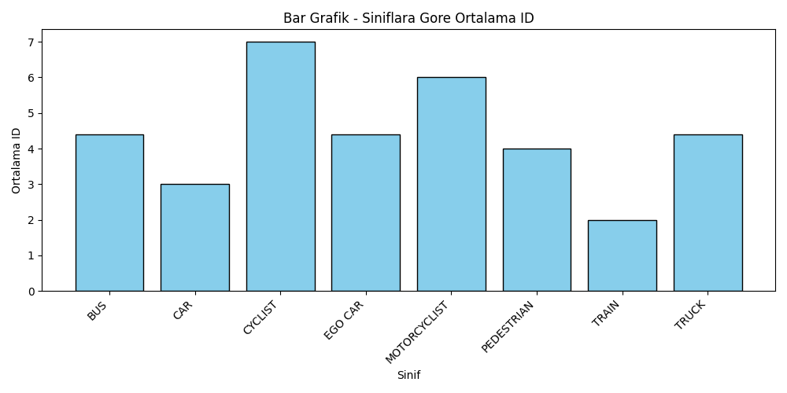
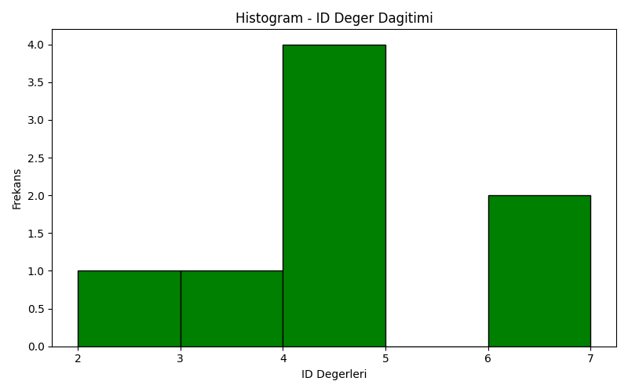
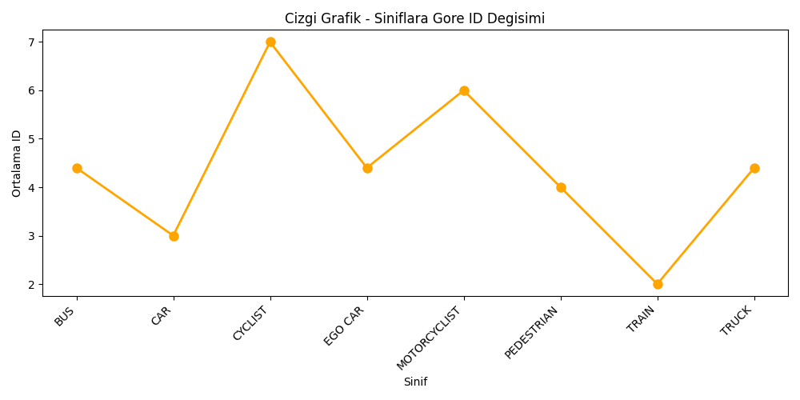
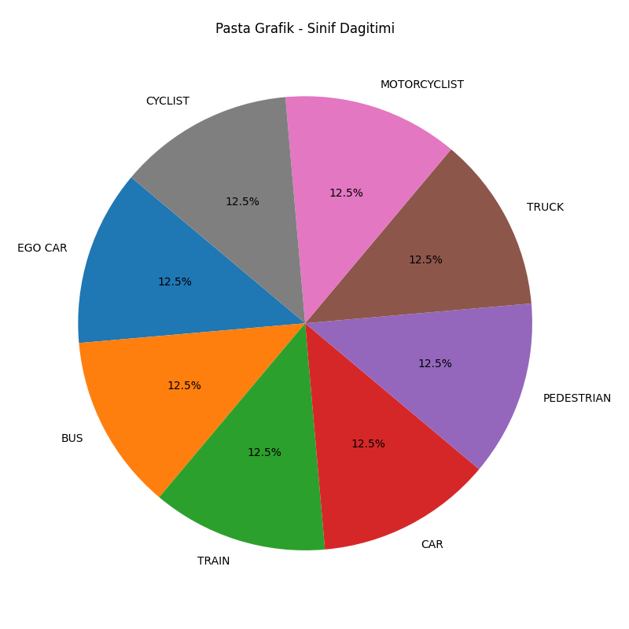

# PandasProject

A Python data analysis project developed using **Pandas** and **Matplotlib**.

## About the Project

This project demonstrates basic data analysis and data visualization operations in Python.

The dataset is read from CSV files and processed using Pandas. Different types of charts are then created to visualize the analyzed data.

## Technologies Used

- Python
- Pandas
- Matplotlib
- CSV

## Features

- Reading data from CSV files
- Data analysis using Pandas
- Data filtering and processing
- Creating different data visualizations
- Exporting generated charts as PNG files

## Visualizations

The project generates the following charts:

### Bar Chart



### Histogram



### Line Graph



### Pie Chart



## Project Files

- `main.py` - Main Python source code
- CSV files - Datasets used in the project
- `bar_chart.png` - Generated bar chart
- `histogram.png` - Generated histogram
- `line_graph.png` - Generated line graph
- `pie_chart.png` - Generated pie chart

## How to Run

Install the required Python libraries:

```bash
pip install pandas matplotlib
